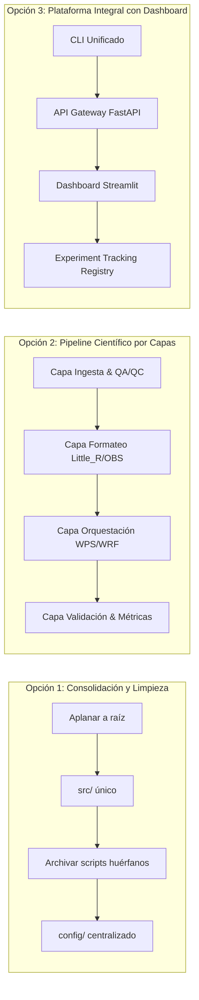

# Arquitectura del Sistema y Gobernanza de Experimentos
**Proyecto:** Asimilación de observaciones de la red meteorológica del PGICH en el modelo WRF para mejorar pronósticos locales en el Valle de Tulum, San Juan  
**Programa:** Maestría en Informática — Universidad Nacional de San Juan (UNSJ)  
**Autor:** Roberto Nicolas Molina  
**Fecha de Elaboración:** 26 de agosto de 2026  
**Documento:** `Arquitectura_Ant_26082026.md`

---

## 1. Resumen Ejecutivo y Contexto General

El proyecto tiene por objetivo principal desarrollar e implementar un prototipo informático de **asimilación de datos meteorológicos de superficie (FDDA / Observational Nudging)** en el modelo **WRF (Weather Research and Forecasting v4.5)**, utilizando las observaciones de la red de estaciones domésticas **EcoWitt** gestionadas por el **Programa de Gestión Integral de Cuencas Hidrográficas (PGICH)** en la provincia de San Juan, Argentina.

### Objetivos Específicos del Sistema
1. **Fase 1 (Ingesta y Calidad):** Adquisición automatizada (vía API EcoWitt en tiempo real e histórico) y preprocesamiento con control de calidad (QA/QC).
2. **Fase 2 (Configuración WRF/WPS):** Inicialización del dominio regional centrado en San Juan (80×60 puntos a 15 km de resolución horizontal) con datos GFS 0.25°.
3. **Fase 3 (Asimilación):** Conversión de observaciones a formato `Little_R` y `OBS_DOMAIN101` (FORMAT 105), integrándolas a WRF mediante nudging de superficie.
4. **Fase 4 (Evaluación y Validación):** Comparación estadística objetiva (Bias, MAE, RMSE, Pearson $r$) entre la corrida de control (sin asimilación) y la corrida asimilada (*nudged*) frente a las observaciones reales.
5. **Fase 5 (Integración y Transferencia):** Generación de reportes científicos reproducibles y visualización interactiva para transferencia tecnológica al PGICH.

---

## 2. Diagnóstico del Estado Actual del Proyecto

### 2.1 Flujo de Datos y Ejecución Existente

```
┌─────────────────────────────────────────────────────────────────────────────┐
│  1. INGESTA (API EcoWitt)                                                   │
│     - lector_pgich.py (Tiempo Real) -> data/raw/ecowitt_todos_*.json        │
│     - obtener_historico.py (Histórico) -> historico/ecowitt_historico_*.json│
└──────────────────────────────────────┬──────────────────────────────────────┘
                                       ▼
┌─────────────────────────────────────────────────────────────────────────────┐
│  2. CONTROL DE CALIDAD Y CONVERSIÓN DE FORMATO                              │
│     - limpiador_pgich.py -> DataFrame / CSV validado                        │
│     - generador_littler.py -> Archivo Little_R (ASCII Fortran)              │
│     - littler_a_obsnud.py -> OBS_DOMAIN101 (Formato 105 de WRF)             │
└──────────────────────────────────────┬──────────────────────────────────────┘
                                       ▼
┌─────────────────────────────────────────────────────────────────────────────┐
│  3. PREPROCESAMIENTO WPS                                                    │
│     - GFS 0.25° (NOMADS / AWS S3) -> ungrib -> metgrid                      │
│     - Generación de met_em.d01.*.nc                                         │
└──────────────────────────────────────┬──────────────────────────────────────┘
                                       ▼
┌─────────────────────────────────────────────────────────────────────────────┐
│  4. SIMULACIÓN WRF                                                          │
│     - real.exe -> wrfinput_d01, wrfbdy_d01                                  │
│     - wrf.exe Nudged (obs_nudge_opt = 1) -> wrfout_nudged.nc                │
│     - wrf.exe Control (obs_nudge_opt = 0) -> wrfout_control.nc              │
└──────────────────────────────────────┬──────────────────────────────────────┘
                                       ▼
┌─────────────────────────────────────────────────────────────────────────────┐
│  5. VALIDACIÓN Y POST-PROCESO                                               │
│     - valida_wrf.py (Extracción de nodos WRF vs coordenadas de estaciones)  │
│     - Métricas estadísticas (T2, RH, WSPD, PSFC) + Gráficos PNG             │
│     - metricas_resumen.txt / scatter_4panels.png / mapa_errores_t2.png      │
└─────────────────────────────────────────────────────────────────────────────┘
```

---

### 2.2 Inventario de Hallazgos y Deuda Técnica

| Categoría | Hallazgo / Problema Identificado | Impacto |
|---|---|---|
| **Estructura** | Dispersión de >20 scripts exploratorios en la raíz (`test_nomads*.py`, `find_gfs*.py`, `check_domain*.py`, etc.). | Dificulta la lectura del repositorio y confunde el flujo principal. |
| **Arquitectura** | Doble nivel de proyecto: raíz vs subcarpeta `tesis_wrf_pgich/` con sus propios `src/`, `data/`, `historico/`. | Rutas relativas frágiles y duplicación de directorios. |
| **Metadatos** | Coordenadas de estaciones definidas en 4 lugares (`estaciones.json`, `lector_pgich.py`, `obtener_historico.py`, `valida_wrf.py`). | Riesgo de inconsistencia en la interpolación espacial. |
| **Asimilación** | Duplicación entre `historico_a_obsnud.py` y `littler_a_obsnud.py`. Uno carece del fix de plataforma SYNOP. | Potencial generación de archivos no asimilables por WRF. |
| **Validación** | La interpolación espacial en `valida_wrf.py` es ponderación por distancia inversa (IDW) de 4 nodos, no bilineal estricta. Duplicación de $N$ si hay varias lecturas por ventana. | Sesgo en las métricas de evaluación si no se unifica la ventana. |
| **Gobernanza** | Informes de experimentos aislados (`informe_exp_gcoef_26082026.md` en raíz, `experimento_nudging_20260812.md` en docs, carpetas `validacion/` y `validacion_20260705/` separadas). | Imposibilidad de comparar corridas masivas o trazar hiperparámetros. |

---

## 3. Opciones de Mejora en la Arquitectura de Software

Se presentan tres alternativas de modernización arquitectónica, diseñadas para ser ejecutadas incrementalmente:



---

### Opción 1: Consolidación Modular y Limpieza Inmediata (Prioridad Alta)
* **Objetivo:** Unificar la estructura de directorios, eliminar redundancias y consolidar un único paquete Python gestionado con `uv`.
* **Detalles Técnicos:**
  1. Mover `tesis_wrf_pgich/src/` directamente a `src/` en la raíz.
  2. Mover todos los scripts temporales (`test_nomads*.py`, `check_*.py`, `descargar_gfs_*.py`) a una carpeta `scripts/exploratory/`.
  3. Consolidar todas las configuraciones en `config/` (`estaciones.json`, `namelist.input.template`, `namelist.wps.template`), eliminando diccionarios hardcodeados en código.
  4. Mantener `pyproject.toml` en la raíz del repositorio con soporte para `uv`.

---

### Opción 2: Arquitectura de Pipeline Científico por Capas (Recomendada para la Tesis)
* **Objetivo:** Desacoplar las responsabilidades en módulos independientes y testeables para garantizar la reproducibilidad científica.

```
src/
├── ingesta/                  # Capa 1: Conexión con APIs y descarga
│   ├── ecowitt_client.py     # Cliente HTTP robusto (reintentos, backoff)
│   └── gfs_downloader.py     # Descargador GFS (NOMADS / AWS S3)
│
├── calidad/                  # Capa 2: Control de Calidad (QA/QC)
│   ├── qc_rules.py           # Filtros físicos: límites climáticos, persistencia, spikes
│   └── cleaner.py            # Normalización de timestamps y coerción de tipos
│
├── asimilacion/              # Capa 3: Formateo para WRF
│   ├── littler_writer.py     # Conversión DataFrame -> Little_R Fortran
│   └── obsnud_writer.py      # Conversión Little_R -> OBS_DOMAIN101 (Formato 105)
│
├── modelo/                   # Capa 4: Ejecución y Orquestación WRF/WPS
│   ├── namelist_manager.py   # Parcheo de fechas y parámetros FDDA
│   ├── wps_runner.py         # geogrid, ungrib, metgrid
│   └── wrf_runner.py         # real.exe, wrf.exe (nudged y control)
│
├── validacion/               # Capa 5: Evaluación Estadística
│   ├── spatial_interp.py     # Interpolación espacial rigurosa a coordenadas de estación
│   └── metrics.py            # Cálculo de Bias, MAE, RMSE, Pearson r
│
└── reporting/                # Capa 6: Generación Automática de Informes
    ├── plot_generator.py     # Generación de gráficos (scatter, mapas, series temporales)
    └── report_builder.py     # Renderizado de INFORME.md y manifest.json
```

---

### Opción 3: Plataforma Integral con Dashboard y Experiment Tracking
* **Objetivo:** Vincular la interfaz visual en Streamlit con un motor de seguimiento de experimentos (Experiment Registry).
* **Detalles Técnicos:**
  * **Experiment Registry:** Archivo `experiments/registry.jsonl` o base SQLite ligera que indexa cada simulación con su identificador, parámetros, rutas de salida y métricas clave.
  * **Interfaz Web:** Aplicación Streamlit (`app.py`) que permite:
    - Ver estado de estaciones en tiempo real.
    - Lanzar ejecuciones o experimentos parametrizados.
    - Comparar gráficos y tablas de métricas entre múltiples experimentos de forma interactiva.

---

## 4. Esquema de Ordenamiento y Gobernanza de la Información

Para asegurar que cada corrida quede documentada de forma inmutable y trazable para los capítulos de la tesis, se establece la siguiente estructura de gobierno:

### 4.1 Estructura del Directorio de Experimentos (`experiments/`)

```text
experiments/
├── experiment_registry.jsonl        # Índice maestro de todos los experimentos ejecutados
│
├── EXP-20260812-ZONDA-01/           # Directorio único por corrida/experimento
│   ├── manifest.json                # Metadatos completos (parámetros, commit git, fecha)
│   ├── inputs/                      # Archivos de entrada exactos
│   │   ├── namelist.input           # Namelist utilizado
│   │   ├── namelist.wps             # Configuración WPS
│   │   ├── OBS_DOMAIN101            # Observaciones asimiladas
│   │   └── obs_input.csv            # Tabla de observaciones preprocesadas
│   ├── metrics/                     # Resultados tabulares
│   │   ├── metricas_resumen.json    # Métricas en formato máquina
│   │   └── metricas_resumen.csv    # Métricas en tabla plana
│   ├── plots/                       # Figuras y mapas generados
│   │   ├── scatter_4panels.png      # Dispersión Modelo vs Obs
│   │   ├── mapa_errores_t2.png      # Mapa espacial de errores
│   │   └── series_tiempo.png        # Evolución temporal por estación
│   ├── logs/                        # Trazabilidad de ejecución
│   │   ├── real.log                 # Log de real.exe
│   │   ├── wrf_nudged.log           # Log de wrf.exe asimilado
│   │   └── wrf_control.log          # Log de wrf.exe control
│   └── INFORME.md                   # 📄 Informe técnico autogenerado
│
└── EXP-20260826-GCOEF-02/
    ├── manifest.json
    ├── metrics/
    ├── plots/
    ├── logs/
    └── INFORME.md
```

---

### 4.2 Manifiesto Estructurado del Experimento (`manifest.json`)

Cada experimento almacena su configuración completa en formato JSON:

```json
{
  "experiment_id": "EXP-20260826-GCOEF-0005",
  "name": "Calibración obs_coef_temp 0.0005",
  "created_at": "2026-08-26T10:30:00-03:00",
  "author": "Roberto Nicolas Molina",
  "git_commit": "eaf45cf",
  "study_case": {
    "event_type": "Zonda / Transición Térmica",
    "start_time": "2026-08-12 00:00:00",
    "end_time": "2026-08-12 12:00:00",
    "domain": "San Juan (80x60, 15km dx)",
    "gfs_cycle": "2026-08-12_00z"
  },
  "fdda_configuration": {
    "grid_fdda": 1,
    "obs_nudge_opt": 1,
    "fdda_start": 0.0,
    "fdda_end": 720.0,
    "obs_coef_temp": 0.0005,
    "obs_coef_wind": 0.0005,
    "obs_coef_mois": 0.0005,
    "obs_rinxy": 50.0,
    "obs_rinfxy": 500.0,
    "obs_twindo": 1.0,
    "obs_npfi": 30,
    "obs_ionf": 1
  },
  "stations_assimilated": [
    {"name": "INTA_POCITO", "lat": -31.6500, "lon": -68.5833, "obs_count": 48},
    {"name": "ULLUM_EMBALSE", "lat": -31.4667, "lon": -68.6667, "obs_count": 48},
    {"name": "ECOHUMUS", "lat": -31.6500, "lon": -68.3000, "obs_count": 48},
    {"name": "PUNTA_NEGRA", "lat": -31.5192, "lon": -68.8178, "obs_count": 48}
  ],
  "execution_status": {
    "wps": "SUCCESS",
    "real_exe": "SUCCESS",
    "wrf_nudged": "SUCCESS",
    "wrf_control": "SUCCESS",
    "validation": "SUCCESS"
  }
}
```

---

### 4.3 Plantilla Estándar para Informes Técnicos (`INFORME.md`)

```markdown
# Informe de Experimento: [EXP_ID] — [Nombre Descriptivo]

**Fecha de Simulación:** AAAA-MM-DD  
**Caso de Estudio:** [Tipo de Evento: Zonda, Frente Frío, Convección, etc.]  
**Estado:** [Completado con Éxito / Advertencias / Fallo]  
**Manifiesto Técnico:** `manifest.json`

---

## 1. Objetivo del Experimento
[Descripción del propósito de la simulación, hipótesis a evaluar y parámetros modificados respecto a la línea base].

## 2. Configuración de Asimilación (FDDA)
- **Ventana temporal (`obs_twindo`):** ±X.X h
- **Radio de influencia espacial (`obs_rinxy`):** XX.X km
- **Coeficientes de relajación:**
  - `obs_coef_temp`: X.XXXX
  - `obs_coef_wind`: X.XXXX
  - `obs_coef_mois`: X.XXXX
- **Estaciones asimiladas:** [Listado de estaciones y observaciones procesadas]

## 3. Métricas Comparativas de Validación (Nudged vs Control)

| Variable Meteorológica | Bias Control | Bias Nudged | RMSE Control | RMSE Nudged | Mejora RMSE (%) | Correlación r (Nudged) |
|---|---|---|---|---|---|---|
| **Temperatura 2m (T2)** | +X.XX K | +X.XX K | X.XX K | X.XX K | **+XX.X%** | 0.XX |
| **Humedad Relativa (RH)** | -X.XX % | -X.XX % | X.XX % | X.XX % | **+XX.X%** | 0.XX |
| **Viento 10m (WSPD)** | X.XX m/s | X.XX m/s | X.XX m/s | X.XX m/s | **+XX.X%** | 0.XX |
| **Presión Superficie (PSFC)** | -XX.X hPa | -XX.X hPa | XX.X hPa | XX.X hPa | **+XX.X%** | 0.XX |

## 4. Evidencia Gráfica
### Dispersión Observado vs Modelado


### Distribución Espacial de Errores


## 5. Análisis Físico y Conclusiones para la Tesis
- **Impacto de la asimilación:** [Descripción de mejoras o degradaciones en las variables clave].
- **Comportamiento en capas límite:** [Análisis térmico, transiciones diurnas/nocturnas].
- **Recomendación para la configuración operativa:** [Conclusión aplicable al sistema PGICH].
```

---

## 5. Clasificación y Migración de Experimentos Previos

Los experimentos ya realizados se ordenarán bajo esta nueva nomenclatura dentro de `experiments/`:

1. **`EXP-20260705-PRETEST`:** Primeras pruebas de circuito con datos de julio 2026 (proveniente de `validacion_20260705/`).
2. **`EXP-20260812-ZONDA-BASE`:** Experimento de validación del ciclo completo de 12 horas con nudging activo (proveniente de `results/2026-08-12_0000z/` y `docs/experimento_nudging_20260812.md`).
3. **`EXP-20260826-GCOEF-STUDY`:** Ensayo de calibración del coeficiente `obs_coef_temp` con 5 configuraciones (`[0.0001, 0.0005, 0.0010, 0.0020, 0.0050]`, proveniente de `informe_exp_gcoef_26082026.md`).

---

## 6. Plan de Implementación por Fases

```text
Fase 1: Reorganización Estructural
├── Mover tesis_wrf_pgich/src/ -> src/
├── Centralizar config/estaciones.json y namelists
└── Mover scripts ad-hoc a scripts/exploratory/

Fase 2: Gobernanza de Experimentos
├── Crear directorio experiments/ e inicializar registry.jsonl
├── Migrar los 3 casos históricos a sus carpetas EXP-*
└── Estandarizar manifest.json e INFORME.md en cada uno

Fase 3: Automatización del Pipeline
├── Integrar el generador de reportes en pipeline_wrf.py
├── Propagar parámetros CLI (--ventana-min, coeficientes)
└── Actualizar Streamlit para lectura desde experiments/
```

Este esquema asegura el cumplimiento de los estándares de investigación científica de posgrado, garantizando reproducibilidad, trazabilidad y claridad en la presentación de los resultados de la tesis de maestría.
