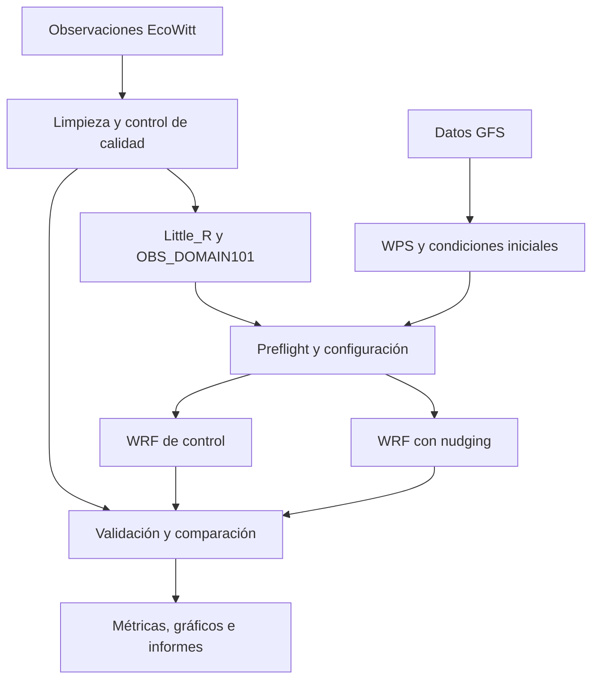

# Análisis de estructura y mejoras del proyecto

**Fecha:** 13 de septiembre de 2026  
**Proyecto:** PGICH WRF Modular  
**Alcance:** Revisión estática del código y la configuración. No se ejecutaron simulaciones ni pruebas durante este análisis.

El proyecto tiene una organización modular por etapas del procesamiento meteorológico, aunque parte de la lógica todavía está concentrada en los scripts que coordinan las ejecuciones.

## 1. Estructura principal

| Carpeta | Responsabilidad |
|---|---|
| `src/ingesta/` | Obtener observaciones EcoWitt y descargar datos GFS. |
| `src/calidad/` | Limpiar, normalizar y controlar los valores observados. |
| `src/asimilacion/` | Generar Little_R y `OBS_DOMAIN101` para la asimilación. |
| `src/modelo/` | Gestionar namelists y ejecutar WPS y WRF. |
| `src/preflight/` | Comprobar observaciones y configuración antes de ejecutar WRF; puede bloquear la corrida. |
| `src/validacion/` | Interpolar resultados, calcular métricas y comparar control con nudging. |
| `src/reporting/` | Crear gráficos, manifiestos, informes y registros de experimentos. |
| `src/casos/` | Coordinar casos de estudio, descargas, ejecuciones e informes. |
| `config/` | Catálogo de estaciones, casos, reglas de preflight y plantillas. |
| `tests/` | Pruebas del circuito modular, preflight, casos y validación temporal. |
| `documentacion_proyecto/` | Arquitectura, manuales y documentación de la tesis. |
| `results/` e `informes_ejecucion/` | Resultados y evidencia de los experimentos. |

## 2. Flujo general

## 3. Puntos de entrada

- `pipeline_wrf.py`: prepara observaciones, ejecuta nudging y control, y llama a la validación. WPS queda fuera de este flujo principal.
- `src/casos/run_casos.py`: coordina el flujo más amplio para los casos configurados, incluyendo preparación de datos y WPS.
- `app_streamlit.py`: interfaz gráfica, con ejecución apoyada en scripts Bash.
- `wrf_runner_cli.py`: entrada específica para ejecutar el modelo.

## 4. Hallazgos y mejoras propuestas

### 4.1. Separación de responsabilidades incompleta

La separación de responsabilidades es una buena base, pero está incompleta. `src/validacion/valida_wrf_cli.py` tiene 612 líneas y reúne lectura, interpolación, métricas, gráficos y salida de informes. Esas responsabilidades también aparecen en módulos especializados.

**Mejora propuesta:** hacer que la CLI utilice los módulos especializados para evitar divergencias y reducir la concentración de lógica.

### 4.2. Varios caminos de ejecución

El pipeline Python y `run_full_pipeline.sh` coordinan corridas control/nudging. Mantener ambos exige asegurar que apliquen las mismas comprobaciones y criterios de éxito.

**Mejora propuesta:** unificar la coordinación de corridas o centralizar las reglas compartidas, manteniendo consistentes las comprobaciones y el tratamiento de resultados.

### 4.3. Configuración dependiente de máquinas concretas

Hay rutas predeterminadas `/home/roberto/...` y `/home/pgich/...` en distintos componentes. Aunque existen variables de entorno, falta centralizar los perfiles de ejecución.

**Mejora propuesta:** centralizar las rutas y los parámetros del entorno en una configuración común con perfiles de ejecución.

### 4.4. README desactualizado

El README indica instalar `requirements.txt` y copiar `.env.example`, que no están en la copia actual. También menciona scripts ausentes y afirma que datos y resultados están excluidos, aunque hay archivos versionados. Las dependencias reales están en `pyproject.toml` y `uv.lock`.

**Mejora propuesta:** actualizar las instrucciones de instalación, configuración, ejecución y estructura para que correspondan con los archivos disponibles.

### 4.5. Valores predeterminados en los informes

`src/reporting/report_builder.py` puede completar estados como exitosos y conclusiones favorables sin derivarlas de los resultados. Para la tesis, deberían depender explícitamente de la evidencia.

**Mejora propuesta:** generar los estados de ejecución y las conclusiones a partir de resultados comprobados, evitando afirmaciones favorables automáticas cuando falta información.

### 4.6. Ejecución orientada a Linux

El proyecto usa Bash, MPI y rutas Linux. Además, los resultados WRF con `:` en sus nombres impiden una extracción completa en Windows, como ocurrió al clonar. Esos archivos quedaron excluidos de la copia de trabajo mediante extracción selectiva y siguen conservados en Git.

**Mejora propuesta:** documentar el entorno de ejecución requerido y separar los resultados voluminosos del código, contemplando la compatibilidad de los nombres de archivo con Windows.

## 5. Prioridades sugeridas

1. Centralizar la configuración y los perfiles de ejecución.
2. Unificar la coordinación de corridas y sus comprobaciones.
3. Conectar la validación con los módulos reutilizables.
4. Actualizar el README para reflejar el estado actual.
5. Separar los resultados voluminosos del código.

La revisión de los estados y las conclusiones automáticas de los informes también debe atenderse antes de utilizar esos informes como evidencia de la tesis.
